# DevPulse 🚀

### *An Enterprise-Grade Agentic GitHub Intelligence Platform*

**DevPulse** is a modular, AI-powered GitHub Intelligence Platform designed to demonstrate how modern, production-grade Agentic AI systems are architected. Using the **Model Context Protocol (MCP)**, **LangGraph Multi-Agent Orchestration**, and **ReAct agent loops**, DevPulse acts as an autonomous engineering assistant that can reason, plan, execute complex GitHub analysis, and expose its skills to external AI systems.

---

## 📖 Table of Contents
1. [Key Features](#-key-features)
2. [Architecture Overview](#-architecture-overview)
3. [Folder Structure](#-folder-structure)
4. [Getting Started](#-getting-started)
   - [Prerequisites](#prerequisites)
   - [Local Installation](#local-installation)
   - [Configuration (.env)](#configuration-env)
   - [Running the Services](#running-the-services)
   - [Docker Deployment](#docker-deployment)
5. [FastAPI Endpoints](#-fastapi-endpoints)
6. [Roadmap](#-roadmap)
7. [Learning Outcomes](#-learning-outcomes)

---

## ✨ Key Features

- **Multi-Agent Orchestration (LangGraph):** Employs a router-agent pattern to classify user intent and delegate requests to specialized ReAct agents.
- **Model Context Protocol (MCP):** Connects specialist agents to real-time tools via an MCP Server.
- **Specialized Reasoning Agents:**
  - **Repository Analyst Agent (`repo_agent.py`):** Inspects repo stars, forks, contributors, and general metadata.
  - **Issue Triage Agent (`issue_agent.py`):** Lists, reviews, and triages open issues.
  - **Release Notes Agent (`release_agent.py`):** Fetches and analyzes latest releases.
  - **Analytics Agent (`analytics_agent.py`):** Evaluates repository health scores and contributor/bus-factor insights.
  - **Security Agent (`security_agent.py`):** Performs security and maintenance audits.
  - **Documentation Agent (`documentation_agent.py`):** Audits documentation depth and README structures.
- **Persistent Conversation Memory:** Utilizes SQLite to persist conversation history and context (e.g., remembering the current repository across conversational turns).
- **Flexible LLM Backend Support:** Seamlessly switch between **Ollama** (local), **Groq** (low-latency cloud), and **OpenAI** without changing any code.
- **Agent-to-Agent (A2A) Discovery:** Publishes an "Agent Card" (`/devpulse`) to allow external AI clients to discover and query DevPulse's capabilities.
- **High-Fidelity Dashboard:** Streamlit frontend with visual charts, health scorecard displays, side-by-side repository comparisons, and real-time chat interface.

---

## 🏗️ Architecture Overview

DevPulse is structured as an Enterprise-Grade Multi-Agent Platform. A FastAPI gateway acts as the controller, managing state and routing requests to the LangGraph orchestration loop.

```mermaid
graph TD
    User([User CLI / Web Streamlit]) --> Controller[FastAPI Gateway]
    Controller --> Graph[LangGraph Agentic Loop]
    Graph --> Router{Intent Classifier}
    
    Router -->|repo_info| RepoAgent[Repository Analyst Agent]
    Router -->|issue_triage| IssueAgent[Issue Triage Agent]
    Router -->|release_notes| ReleaseAgent[Release Notes Agent]
    Router -->|analytics| AnalyticsAgent[Analytics Agent]
    Router -->|security| SecurityAgent[Security Agent]
    Router -->|documentation| DocAgent[Documentation Agent]
    
    RepoAgent --> MCP[MCP Client Bridge]
    IssueAgent --> MCP
    ReleaseAgent --> MCP
    AnalyticsAgent --> MCP
    SecurityAgent --> MCP
    DocAgent --> MCP
    
    MCP --> Server[FastMCP Server Subprocess]
    Server --> GitHub[GitHub REST API]
    
    Controller <--> SQLite[(SQLite Memory & Context)]
```



For a deeper dive into the system design, see [docs/architecture.md](file:///c:/Allen/projects/devpluse/docs/architecture.md).

---

## 📁 Folder Structure

The project layout follows production-ready Python project organization:

```text
DevPulse/
├── agent_graph/            # LangGraph routing and state orchestration
│   ├── graph.py            # LangGraph workflow definition
│   ├── router.py           # Intent classification and routing logic
│   └── state.py            # Shared workflow state schemas
├── agents/                 # Specialist ReAct agents
│   ├── repo_agent.py       # Inspects metadata & details of repos
│   ├── issue_agent.py      # Triages & manages issues
│   ├── release_agent.py    # Analyzes releases
│   ├── analytics_agent.py  # Calculates health scores & metrics
│   ├── security_agent.py   # Evaluates vulnerability and archive status
│   ├── documentation_agent.py # Audits README/documentation quality
│   └── a2a_card.py         # Agent-to-Agent discovery card
├── api/                    # FastAPI gateway
│   └── app.py              # REST API controllers & router
├── docs/                   # System design & planning documents
│   ├── architecture.md     # System design diagrams & layers description
│   ├── api.md              # REST API request/response specifications
│   └── roadmap.md          # Development stages & phase descriptions
├── frontend/               # Streamlit application
│   └── streamlit_app.py    # Graphical dashboard & chat UI
├── mcp_impl/               # Model Context Protocol implementation
│   ├── mcp_server.py       # FastMCP server registration (tools, resources, prompts)
│   └── bridge.py           # Client-side MCP connection broker
├── memory/                 # Persistent storage
│   └── sqlite_memory.py    # SQLite session and conversational history manager
├── models/                 # Unified LLM provider interface
│   └── model_client.py     # Integrates OpenAI, Groq, and Ollama clients
├── tools/                  # Lower-level HTTP integration with GitHub APIs
│   ├── github_tools.py     # GitHub REST API wrappers
│   └── analytics_tools.py  # Repository metrics and analytics math
├── Dockerfile              # Docker container configuration
├── docker-compose.yml      # Service composition for API & UI
├── requirements.txt        # Project python packages
└── plan.md                 # Original architecture and objectives plan
```

---

## 🚀 Getting Started

### Prerequisites
- **Python 3.10+**
- **Git**
- Optional: **Ollama** (for local model hosting)
- Optional: **Docker** & **Docker Compose** (for containerized setup)

### Local Installation

1. **Clone the repository:**
   ```bash
   git clone <repository-url>
   cd devpulse
   ```

2. **Create and activate a virtual environment:**
   ```bash
   python -m venv .venv
   # On Windows:
   .venv\Scripts\activate
   # On macOS/Linux:
   source .venv/bin/activate
   ```

3. **Install dependencies:**
   ```bash
   pip install -r requirements.txt
   ```

---

### Configuration (.env)

Create a `.env` file in the project root. You can copy the template from `.env.example`:

```bash
cp .env.example .env
```

Configure your backend client by choosing one of the following providers in your `.env`:

```ini
# Choose backend: openai | groq | ollama
LLM_BACKEND=ollama

# Optional: Add a GitHub PAT to raise public API rate limits (60/hr -> 5000/hr)
GITHUB_TOKEN=your_github_personal_access_token

# For Ollama Backend (Default)
OLLAMA_BASE_URL=http://localhost:11434/v1
OLLAMA_MODEL=llama3.1:8b

# For OpenAI Backend
OPENAI_API_KEY=your_openai_api_key
OPENAI_MODEL=gpt-4o-mini

# For Groq Backend
GROQ_API_KEY=your_groq_api_key
GROQ_MODEL=llama-3.1-8b-instant
```

---

### Running the Services

You need to run the **FastAPI Backend** and the **Streamlit Frontend** simultaneously.

#### 1. Start the FastAPI Backend Gateway
The backend automatically hosts the FastMCP server as a subprocess.
```bash
# Ensure your virtual environment is active
uvicorn api.app:app --host 0.0.0.0 --port 8000
```
*Backend runs on: `http://localhost:8000`*

#### 2. Start the Streamlit Dashboard UI
Open a new terminal window or tab, activate the virtual environment, and run:
```bash
streamlit run frontend/streamlit_app.py --server.port 8501 --server.address 0.0.0.0
```
*Frontend runs on: `http://localhost:8501`*

---

### Docker Deployment

You can build and deploy the complete stack using the provided Docker settings:

```bash
# Build and run the services
docker-compose up --build
```
This boots up both the FastAPI backend on port `8000` and the Streamlit frontend on port `8501`. Ensure your `.env` is fully configured before launching.

---

## 📡 FastAPI Endpoints

The API gateway serves the frontend as well as external agents querying repository analytics. For a detailed reference, see [docs/api.md](file:///c:/Allen/projects/devpluse/docs/api.md).

- **`GET /`**: Server health check.
- **`GET /devpulse`**: Agent-to-Agent (A2A) Discovery card detailing capabilities and schemas.
- **`POST /chat`**: Sends a query to the LangGraph orchestrator. Keeps track of conversation history in SQLite.
- **`POST /health`**: Directly calculates repository health (stars, activity, issues) without the full agentic chat loop.
- **`POST /compare`**: Performs a side-by-side comparison of multiple repositories.
- **`POST /clear`**: Resets conversation history and context repository for a given session.

---

## 🗺️ Roadmap

- **Vector Database Memory:** Implement semantic indexing via `vector_memory.py` with ChromaDB/FAISS to store historical answers, documentation, and triage logs.
- **Issue Auto-Resolution:** Suggest and write PR changes/code modifications to resolve specific open issues.
- **External Agent Communications:** Allow external MCP clients to interactively trigger actions directly on DevPulse endpoints.
- **Third-Party Notifications:** Direct integration with Jira, Slack, Linear, and email platforms.

See [docs/roadmap.md](file:///c:/Allen/projects/devpluse/docs/roadmap.md) for more details.

---

## 🎓 Learning Outcomes

By studying this codebase, you can learn:
1. **MCP Integration:** How to register tools, read-only resources, and triage prompts using `FastMCP`.
2. **LangGraph Workflows:** Orchestrating complex conditional routing paths using state-sharing graph models.
3. **Persistent AI Memory:** Using SQL relational layers to track conversational history and current repository context.
4. **Multi-Model Orchestration:** Structuring provider-agnostic wrappers (`model_client.py`) that cleanly transition from cloud services to local Ollama clusters.
