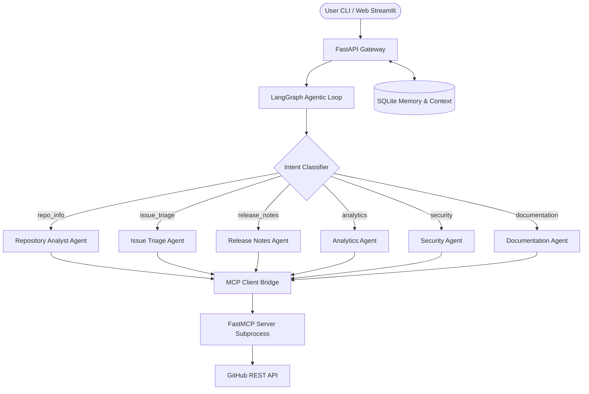

# DevPulse Architecture

DevPulse is structured as an Enterprise-Grade Multi-Agent Platform utilizing Model Context Protocol (MCP) and LangGraph to perform deep repository inspections, security compliance checks, and analytics on GitHub.

## Architectural Layers

1. **Frontend / Gateway Interface**:
   - Streamlit dashboard providing visual metrics, charts, side-by-side repository comparative cards, and a real-time conversational interface.
   - FastAPI gateway acting as the REST API controller for frontend integration and Agent-to-Agent (A2A) discovery requests.

2. **Orchestrator Layer (LangGraph & Router)**:
   - Evaluates incoming queries, parses and tracks repository names across conversational turns.
   - Restores/maintains repository context state using SQLite.
   - Classifies query category and dispatches execution state to the specific specialist agent.

3. **Specialist Agents**:
   - Each specialist agent behaves as a ReAct loop with a narrowed subset of available tools, ensuring higher accuracy and reduced token usage.

4. **MCP Bridge & Server**:
   - Launches a standalone FastMCP server subprocess that exposes live operations as standard JSON-schema tool inputs.
